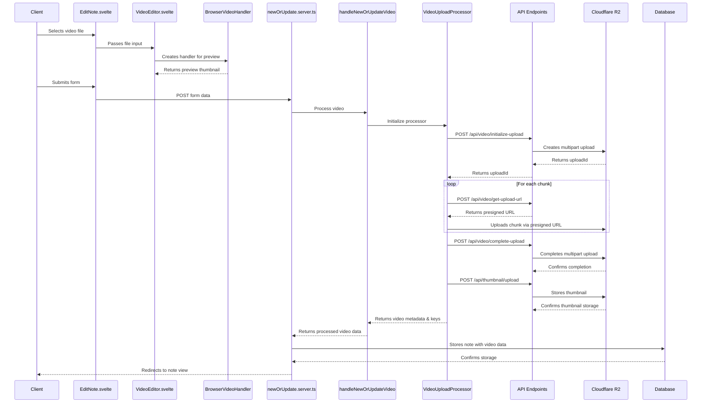

<details><summary>Build steps</summary>

## Building

To create a production version of your app:

```bash
npm run build
```

You can preview the production build with `npm run preview`.

> To deploy your app, you may need to install an
> [adapter](https://kit.svelte.dev/docs/adapters) for your target environment.

</details>

## Images

The decision to place images in the `src/lib/images` folder is due to vites
adding of hashes to the filename at compile time. The hash is based on image
contents so when the file is changed so is the hash, which allows the server to
send a very long cache expiration to the browser, so it can cache it forever or
until it changes (key-based cache expiration). See a full explanation in the top
answer here
https://stackoverflow.com/questions/71789244/where-to-put-images-with-sveltekit.

### Video

Below is a squence diagram showing the flow of uploading a video:


